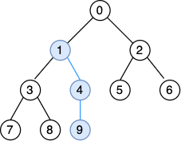
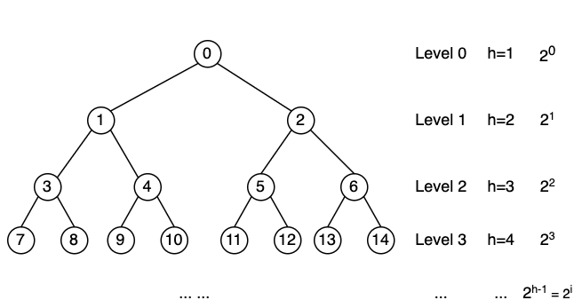

# Heap Sort 堆排序

## 堆

## 算法思想

堆排序算法，顾名思义，是基于堆这种数据结构所设计的排序算法。利用了堆顶元素为最大值(最小值)这一特性。

堆排序 = 构造堆 + 交换堆顶元素与堆尾元素 + 删除堆尾元素 + 调整堆 + 交换堆顶元素与堆尾元素 + 删除堆尾元素 + 调整堆 ... 依次循环，直到堆内只有一个元素为止。

由于每次堆顶元素都是堆中的最大值(最小值)，所以删除出来的元素序列也必定是升序(降序)的。

## 实现方法

用数组来存储二叉堆

步骤：

1. 先将初始数据nums[0...n-1]建成一个最大堆(最小堆)
2. 再将堆顶元素nums[0]，即最大值(最小值)，与堆尾元素nums[n-1]交换，并删除堆尾元素，由此得到无序区nums[0...n-2]和有序区nums[n-1]
3. 由于交换后的堆顶元素nums[0]可能违反堆性质，所以需要调整nums[0...n-2]，使其满足堆的性质
4. 重复步骤2、3，直到堆内只有一个元素为止

## 复杂度分析

### 假设

* 数组长度为n

### 时间复杂度

**最优时间复杂度**：$O(n\log n)$

**最差时间复杂度**：$O(n\log n)$

**平均时间复杂度**：$O(n\log n)$

**时间复杂度分析：**

```
    public void sort(int[] nums) {
        buildMaxHeap(nums);

        for (int i = nums.length - 1; i > 0; i--) {
            swap(nums, 0, i);
            maxHeapify(0, nums, i - 1);
        }
    }
```

在堆排序中，时间复杂度主要由两部分组成：

* 一次构建堆
* n-1次交换元素并调整堆

以上两部分都调用了maxHeapify函数，所以需要先分析一下**maxHeapify函数的时间复杂度：**

maxHeapify函数内部的逻辑是对于当前节点：

* 如果存在子节点大于当前节点，则将当前节点与较大的子节点交换，并沿此分支进行递归调整；
* 如果是叶子节点或者子节点均小于当前节点，则返回。

又因为二叉堆是一颗完全二叉树，由此可知，对于任一节点，递归最深可经一条子路径到达叶子节点，需要操作的节点个数即为这条路径上的节点个数，**即为当前节点的高度 = 堆的高度(1-based)-当前节点所在的层数(0-based)**。

例如下图中，节点①为当前节点，则对节点①调用maxHeapify函数需要操作的节点数为4-1=3。



因此，要知道maxHeapify的时间复杂度，需要先计算出堆的高度。设元素总个数为n，堆的高度为**h**，则有h=ceil(log(n+1))=floor(logn)+1，且第i层的节点数为2<sup>i</sup>
（i$\in[0...h-1]$）。



**堆高度的推导过程：**

由上图可知，在二叉堆是满二叉树的情况下，有n = 2<sup>0</sup> + 2<sup>1</sup> + ... + 2<sup>h-2</sup> + 2<sup>h-1</sup> = $2^0\times(
\frac{1-2^h}{1-2})$ = 2<sup>h</sup>-1，即h = log(n+1)。实际情况下，堆的最后一层有可能不满，所以h=ceil(log(n+1))=floor(logn)+1。

所以，对于i层的元素，maxHeapify的时间复杂度为h-i = floor(logn)+1-i（i is 0-based）。

**构建堆的时间复杂度分析：**

在构建堆的过程中，对于每一个非叶节点，都调用一次maxHeapify函数，所以需要知道非叶节点的个数。已知总层数=堆的高度h，非叶节点的个数即为前h-1层节点的个数和。 已证第i层的节点个数为2<sup>i</sup>
，每个节点调用maxHeapify函数所需要的时间是h-i。所以构建堆的所需要的时间为

$T = \sum_{0}^{h-2}(h-i)\times2^i = (h-0)\times2^0 + (h-1)\times2^1 + ... + (h-h+3)\times2^{h-2} + (h-h+2)\times2^{h-1}$

$2\times{T} = (h-0)\times2^1 + (h-1)\times2^2 + ... + (h-h+3)\times2^{h-1} + (h-h+2)\times2^h$

两式相减得，$T = -h + 2^1 + 2^2 + ... + 2^{h-1} + 2\times2^h = (2^1 + 2^2 + ... + 2^{h-1} + 2^h) + 2^h - h =
2\times\frac{1-2^h}{1-2} + 2^h - h = 3\times2^h - h -2$

将h = floor(logn)+1带入可得，$T(n) = 3\times2^{floor(logn)+1} - (floor(logn)+1) - 2 = O(6n - \log n - 3) = O(n)$

**n-1次交换元素并调整堆的时间复杂度分析：**

一次交换元素的时间复杂度为O(1)，n-1次的时间复杂度为O(n-1)。

一次调整堆的时间为对堆顶元素调用一次maxHeapify函数所需要的时间，为floor(logn)+1。循环n-1，每循环一次，有一个节点被删除，总结点数减一，所以循环n-1次所需要的时间$T = (floor(\log n)+1) +
(floor(\log (n-1))+1) + ... + (floor(\log 2)+1) = O(n!) + O(n-1) = O(n\log n)$。

所以，n-1次交换元素并调整堆的时间复杂度为$O(n-1) + O(n\log n) = O(n\log n)$。

至此，可以得出堆排序的时间复杂度为$O(n) + O(n\log n) = O(n\log n)$。

### 空间复杂度

在原数组上操作，空间复杂度为O(1)

## 稳定性分析

堆排序是不稳定的排序算法，重复元素在排序前后的相对位置可能发生变化。重复元素在构建堆和调整堆的过程中相对位置都有可能发生变化，因此不能保证最后有序序列中的相对位置与排序前相同。

## 扩展/优化
