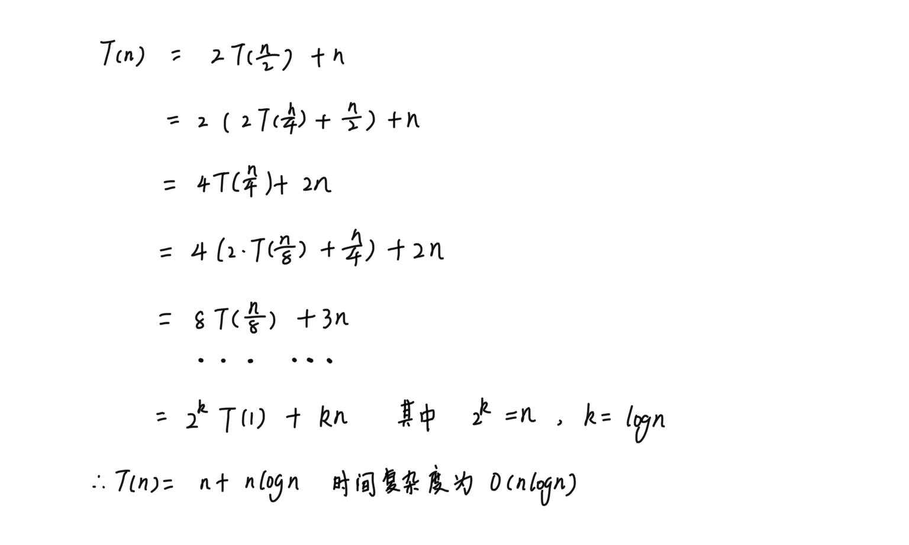

# Merge Sort 归并排序

## 算法思想

分治法

将待排序数组分为若干个子序列，确保每个子序列是有序的，然后再将有序子序列合并为整体有序序列

## 实现方法

递归

## 复杂度分析

### 前提

* 数组长度为n

### 时间复杂度

$T(n) = 2T(\frac{n}{2}) + C(n)$

其中，T(n/2)是对每个子序列排序所需要的时间，C(n)是合并两个有序子序列所需要的时间

**时间复杂度推导**：

**最优时间复杂度**：$O(n\log n)$

**最差时间复杂度**：$O(n\log n)$

**平均时间复杂度**：$O(n\log n)$

### 空间复杂度

需要额外的空间去存储合并后的新序列，所以空间复杂度为O(n)

## 扩展/优化
