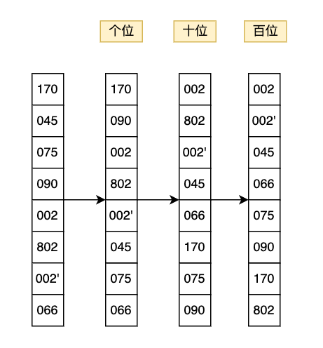

# LSD - Least Significant Digit

## 算法思想

按照从低位到高位的顺序，依次对待排序数组中的元素进行分组排序。
对于每一个数位，将待排序数组中的每一个元素根据其在该数位上的值分配到相应的桶里(i.e. 0~9)，
然后依次输出每个桶里的元素，即可得到部分有序的序列，在此基础上再对下一个数位执行相同操作，直到完成基于最高数位的分组排序，最终可以得到整体有序的序列。

## 实现方法

1. 遍历待排序数组，确定最大位数
2. 从低到高依次对每一个数位执行以下操作:
    1. 遍历待排序数组，根据每个元素当前数位上的数值，将其分配到对应的桶中；
    2. 遍历所有的桶，依次输出桶内的元素，并更新到原数组中。

## 示例

From Wikipedia:

> Input list:
>
> [170, 45, 75, 90, 2, 802, 2, 66]
>
> Starting from the rightmost (last) digit, sort the numbers based on that digit:
>
> [{170, 90}, {2, 802, 2}, {45, 75}, {66}]
>
> Sorting by the next left digit:
>
> [{02, 802, 02}, {45}, {66}, {170, 75}, {90}]
>
> Notice that an implicit digit 0 is prepended for the two 2s so that 802 maintains its position between them.
>
> And finally by the leftmost digit:
>
> [{002, 002, 045, 066, 075, 090}, {170}, {802}]
>
> Notice that a 0 is prepended to all the 1- or 2-digit numbers.



## 复杂度分析

### 假设

* 数组长度为n，最大位数为k

### 时间复杂度

**最优时间复杂度**：当k比较小时，O(n)

**最差时间复杂度**：O(kn)

**平均时间复杂度**：O(kn)

**时间复杂度分析**：

```
public void sort(int[] nums) {
    List<List<Integer>> buckets = new ArrayList<>();
    int maxDigitCount = getMaxDigitCount(nums);
    for (int i = 1; i <= maxDigitCount; i++) {
        distribute(nums, 0, nums.length - 1, i, buckets);
        merge(nums, 0, buckets);
    }
}
```

由以上代码可以看出，LSD基数排序的时间复杂度由两部分组成：

1. 求解最大位数的时间
2. 遍历每个数位分组排序的时间

**求解最大位数的时间：**

需要遍历待排序数组，找到最大值，从而确定最大位数，所以时间复杂度为O(n)。

**遍历数位分组排序的时间：**

对于每一个数位，都要遍历一次待排序数组，将每个元素分配到对应的桶里，并遍历一次桶里的元素输出到原数组，时间复杂度为O(n)。总共需要遍历k个数位，所以此部分的整体时间复杂度为O(kn)。

综上所述，LSD基数排序的最终时间复杂度为O(kn)。

### 空间复杂度

LSD基数排序算法需要额外的空间来存储每个桶和桶内的元素，桶的个数固定为10，所以空间复杂度为O(10+n)=O(n)。

## 稳定性分析

LSD基数排序算法是稳定的排序算法，在具体实现中保证了元素在同一个桶内的入桶和出桶顺序相同，从而保证了重复元素的相对位置的稳定性。

## 扩展/优化
