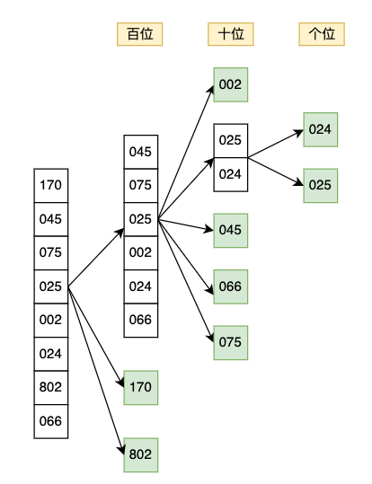

# MSD - Most Significant Digit

## 算法思想

按照从高位到低位的顺序，依次对待排序数组中的元素进行分组排序。
与LSD不同的是，除最高数位外，对于每一个数位，是在前一个数位分配结果的基础上，分别对产生的每个桶里的元素再进行分组排序，即分别将每个桶里的元素根据当前数位的值分配到相对应的新桶里，跳过那些空桶或者只有一个元素的桶(i.e. 已有序)。
最后，依次输出所有叶子桶里的元素即可得到整体有序的序列。

## 实现方法

1. 遍历待排序数组，确定最大位数
2. 从最高位开始执行以下操作：
    1. 遍历指定范围内的元素：
        1. 如果只有一个元素，则返回；
        2. 如果多于一个元素，则根据每个元素当前数位上的数值，将其分配到对应的桶中；
    2. 遍历所有的桶，依次输出桶内的元素，并更新原数组相应范围内的数据；
    3. 遍历所有的桶，对每一个桶所对应的范围，```递归```调用始于**下一个数位**的MSD基数排序。

## 示例

From Wikipedia:
> Input list, fixed width numeric strings with leading zeros:
>
> [170, 045, 075, 025, 002, 024, 802, 066]
>
> First digit, with brackets indicating buckets:
>
> [{045, 075, 025, 002, 024, 066}, {170}, {802}]
>
> Notice that 170 and 802 are already complete because they are all that remain in their buckets, so no further
> recursion is needed
>
> Next digit:
>
> [{ {002}, {025, 024}, {045}, {066}, {075} }, 170, 802]
>
> Final digit:
>
> [ 002, { {024}, {025} }, 045, 066, 075 , 170, 802]
>
> All that remains is concatenation:
>
> [002, 024, 025, 045, 066, 075, 170, 802]



## 复杂度分析

### 假设

* 数组长度为n，最大位数为k

### 时间复杂度

**最优时间复杂度**：O(n)

**最差时间复杂度**：O(kn)

**平均时间复杂度**：O(kn)

**时间复杂度分析**：

```
public void sort(int[] nums) {
    sort(nums, 0, nums.length - 1, getMaxDigitCount(nums));
}
    
private void sort(int[] nums, int left, int right, int i) {
    if (right <= left) {
        return;
    }

    List<List<Integer>> buckets = new ArrayList<>();
    distribute(nums, left, right, i, buckets);
    merge(nums, left, buckets);

    int count = left;
    for (List<Integer> bucket : buckets) {// recursively sort non-empty buckets
        if (!bucket.isEmpty()) {
            sort(nums, count, count + bucket.size() - 1, i - 1);
        }
        count += bucket.size();
    }
}
```

根据以上代码可以看出，MSD基数排序的时间复杂度主要由两部分组成：

1. 求解最大位数的时间
2. 递归进行MSD基数排序的时间

**求解最大位数的时间：**

需要遍历待排序数组，找到最大值，从而确定最大位数，所以时间复杂度为O(n)。

**递归进行MSD基数排序的时间：**

需要计算递归的深度和每次递归所需的时间。

递归的深度：

* 最优的情况下，待排序数组中的元素的最高位数值均不相同，则只需要一次调用即可完成排序，此时递归的深度为1，并且可知此时待排序的元素个数一定不大于所需桶的个数(i.e. 十进制整数所需桶的个数为10)。
* 最差的情况下，需要从最高位递归调用到最低位，此时递归的深度为k。
* 平均递归深度为(1+2+...+k)/k = (k+1)/2

每次递归所需的时间：

* 每次递归都需要将待排序元素根据当前数位上的数值分配到相应的桶里，然后依次输出桶里的元素。时间复杂度为O(n)。

所以递归进行MSD基数排序的时间复杂度为$递归深度\times每次递归所用的时间=O(kn)$。

综上，MSD基数排序的整体时间复杂度为O(n)+O(kn)=O(kn)。

### 空间复杂度

递归的空间复杂度 = 每次递归的空间复杂度 * 递归深度

**递归的深度：** 在时间复杂度部分已经分析过，平均递归深度为(k+1)/2。

**每次递归的空间复杂度：**
每次递归都需要额外的空间来存储每个桶和桶内的元素，桶的个数固定为10，但是桶内元素的个数可能会随着递归的深入而逐渐减少，这是因为每次递归会跳过空桶或者只有一个元素的桶，这些元素不会进入更深层的递归中，可以参考一下示例中的图示。

最优的情况下，待排序数组中的元素的最高位数值均不相同，则只需要一次调用即可完成排序，此时递归深度为1，每次递归的空间复杂度为O(n+10)，所以整体空间复杂度为O(n)。

最差的情况下，待排序数组中所有的元素都是相同的值，此时递归深度为k，每次递归的空间复杂度为O(n+10)，所以整体空间复杂度为O(k(n+10))=O(kn)。

## 稳定性分析

MSD基数排序算法是稳定的排序算法，在具体实现中保证了元素在同一个桶内的入桶和出桶顺序相同，从而保证了重复元素的相对位置的稳定性。

## 扩展/优化