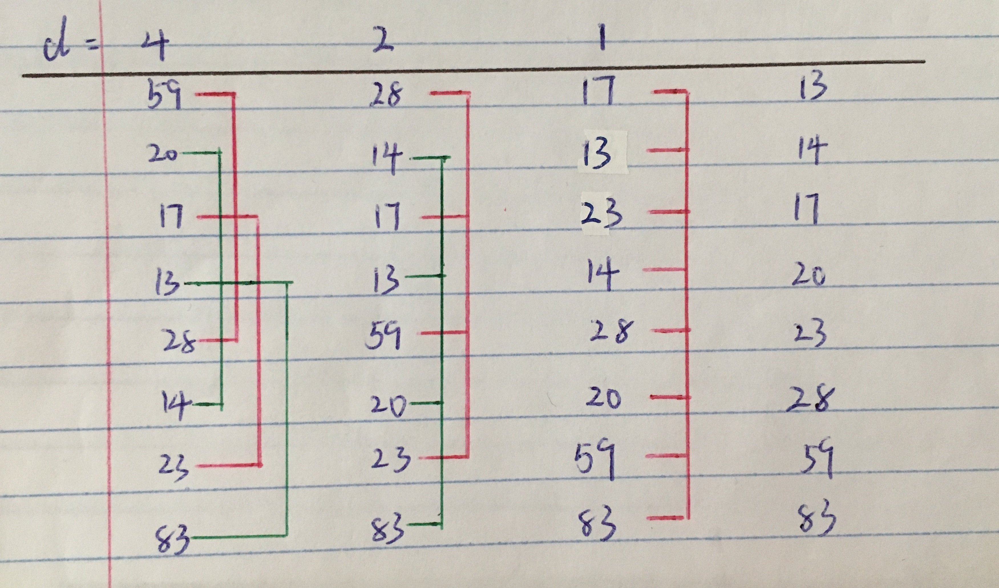
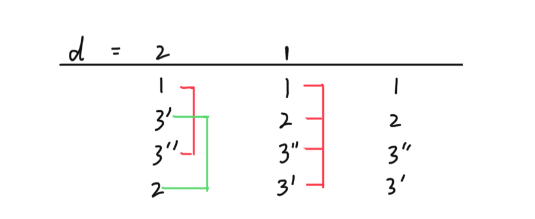

# Shell Sort 希尔排序

## 算法思想

希尔排序又称递减增量排序，是插入排序的改进版本。

选定一个增量值d，基于这个增量值将待排序的数组分为若干子序列（i.e. 每组子序列中的相邻元素下标相差d），并对子序列分别进行插入排序。

然后逐渐缩小增量d，并重复上述过程，直至增量d减为1，此时数据序列基本有序，再对整个数组进行插入排序。

## 实现方法

三重for循环

## 复杂度分析

### 假设

* 数组长度为n

### 时间复杂度

最优时间复杂度：O(n)

最差时间复杂度：O(n2)

平均时间复杂度：O(n1.3)

### 空间复杂度

在原数组上操作，空间复杂度为O(1)

## 稳定性分析

希尔排序是不稳定的排序算法，重复元素在排序前后的相对位置可能会发生改变。

虽然一次插入排序是稳定的，但是希尔排序过程中针对不同子序列进行了不同的插入排序，重复元素可能在不同的插入排序过程中移动，导致相对位置发生改变。

e.g. [1, 3, 3, 2]

## 扩展/优化
