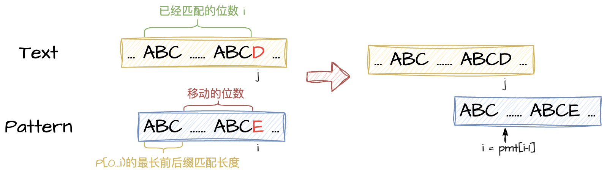
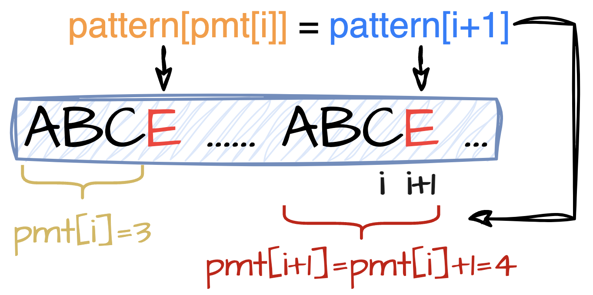
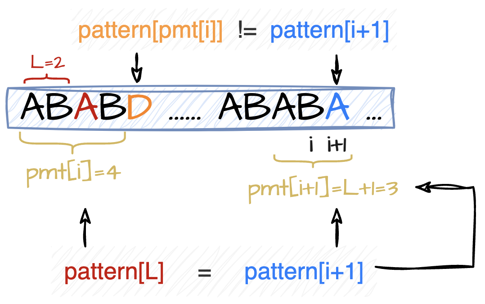
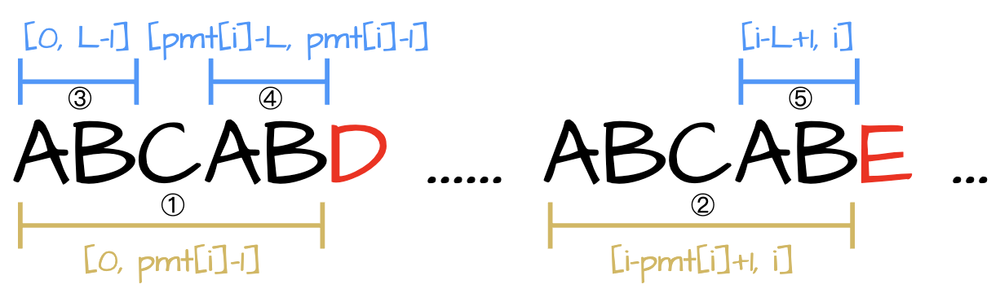

# KMP

Knuth-Morris-Pratt算法

## 解决的问题

**字符串匹配**

给定两个字符串，源字符串text和模式字符串pattern，判断text中是否包含pattern，如果包含，返回第一次匹配时起始位置的下标，否则返回-1。

## 基本思想

如果pattern的组成类似于ABC...ABC，即前缀与后缀匹配，我们可以利用该性质，在text与pattern的匹配过程中跳过那些已经比较过的位置，从而加快匹配的过程。

如果到pattern[i]时发现不匹配，则：

移动的位数 = 已经匹配的位数(i) - pattern[0...i)的最大前后缀匹配长度，即：

移动的目标下标 = pattern[0...i)的最大前后缀匹配长度。



### Partial Match Table

KMP算法的关键在于当发现不匹配时，如何能够快速高效地计算出在pattern中应该移动回到的位置。这就需要我们对模式字符串pattern进行预处理，生成用于快速查询的部分匹配表(PMT)。

定义**pmt[i]** = pattern[0, i]前后缀匹配的最大长度。注意，此处匹配的前后缀是可以重叠相交的，但不能是pattern[0, i]本身。

当检测到pattern[i]与text[j]不匹配时，就可以将i重置为pmt[i-1]，继续与text[j]进行比较，而不需要从pattern[0]开始重新匹配。这是因为已知pattern[0, i-1]=text[j-i, j-1]，并且pattern[0, pmt[i-1]-1]=pattern[i-pmt[i-1], i-1]，则可知pattern[0, pmt[i-1]-1]与text[j-pmt[i-1], j-1]匹配，所以pattern[0, pmt[i-1]-1]这部分是不需要再重复检测的，可以直接跳过。

`Example`

对于字符串ababababca:

- `pattern[0, 0] (a)`的前缀为{}，后缀为{}，所以pmt[0]=0；
- `pattern[0, 1] (ab)`的前缀为{a}，后缀为{b}，所以pmt[1]=0；
- `pattern[0, 2] (aba)`的前缀为{a, ab}，后缀为{a, ba}，所以pmt[2]=len(a)=1；
- `pattern[0, 3] (abab)`的前缀为{a, ab, aba}，后缀为{b, ab, bab}，所以pmt[3]=len(ab)=2；
- `pattern[0, 4] (ababa)`的前缀为{a, ab, aba, abab}，后缀为{a, ba, aba, baba}，所以pmt[4]=len(aba)=3；
- `pattern[0, 5] (ababab)`的前缀为{a, ab, aba, abab, ababa}，后缀为{b, ab, bab, abab, babab}，所以pmt[5]=len(abab)=4；
- `pattern[0, 6] (abababa)`的前缀为{a, ab, aba, abab, ababa, ababab}，后缀为{a, ba, aba, baba, ababa, bababa}，所以pmt[6]=len(ababa)=5；
- `pattern[0, 7] (abababab)`的前缀为{a, ab, aba, abab, ababa, ababab, abababa}，后缀为{b, ab, bab, abab, babab, ababab, bababab}，所以pmt[7]=len(ababab)=6；
- `pattern[0, 8] (ababababc)`的前缀为{a, ab, aba, abab, ababa, ababab, abababa, abababab}，后缀为{c, bc, abc, babc, ababc, bababc, abababc, babababc}，所以pmt[8]=0；
- `pattern[0, 9] (ababababca)`的前缀为{a, ab, aba, abab, ababa, ababab, abababa, abababab,ababababc}，后缀为{a, ca, bca, abca, babca, ababca, bababca, abababca, babababca}，所以pmt[9]=len(a)=1；

所以，最终的pmt=[0, 0, 1, 2, 3, 4, 5, 6, 0, 1]。

#### Partial Match Table的构建

##### Brute Force

对于pattern[0, i]，从最大前缀长度L开始：

* 如果L为0，则pmt[i]=0；
* 如果前缀pattern[0, L)和后缀pattern[i-L+1, i]匹配，则pmt[i]=L；
* 如果前缀pattern[0, L)和后缀pattern[i-L+1, i]不匹配，则将L减一；
* 重复上述步骤，直到发现匹配的前后缀或者L减小到0；

时间复杂度：O(n<sup>3</sup>)

代码：

```
for(int i=1; i<pattern.length(); i++){ // pattern[0, i]
    for(int l=i; l>0; l--){
        if(pattern.substring(0, l).equals(pattern.substring(i-l+1, i+1))){
            pmt[i] = l;
            break;
        }
    }
}
```

##### 线性解法

上述暴力实现法的时间复杂度过高，需要通过优化来降低时间复杂度。

观察得知，pmt[i+1]的最大可能值为pmt[i]+1，可以利用该性质来优化部分匹配表的构建过程。

`Case 1:` pattern[i+1]=pattern[pmt[i]]

当pattern[i+1]=pattern[pmt[i]]时，**pmt[i+1]=pmt[i]+1**。

这种情况比较简单，已知pattern[0, pmt[i]-1]与pattern[i-pmt[i]+1, i]匹配，加之pattern[pmt[i]]=pattern[i+1]，则有pattern[0, pmt[i]]与pattern[i-pmt[i]+1, i+1]匹配，所以pmt[i+1] = pmt[i]+1。



`Case 2:` pattern[i+1]!=pattern[pmt[i]]

当pattern[i+1]!=pattern[pmt[i]]时，**pmt[i+1]<=pmt[i]**。

这种情况复杂一点，因为此时无法直接得到pmt[i+1]的值。需要找到仅次于pmt[i]的长度L，使得pattern[0, L-1]和pattern[i-L+1, i]匹配，即L为满足pattern[0, i]前后缀匹配的第二大长度。

* 如果pattern[i+1]=pattern[L]，则有pattern[0, L]和pattern[i-L+1, i+1]匹配，即pmt[i+1]=L+1；
* 如果pattern[i+1]!=pattern[L]，则需要继续尝试第三大长度L<sup>′</sup>；
* 如果pattern[i+1]!=pattern[L<sup>′</sup>]，则需要继续尝试，直到找到满足pattern[i+1]=pattern[L]的长度L或者L=0。
* 当L=0且pattern[i+1]!=pattern[L]时，pmt[i+1]=0。



`如何快速定位下一个L？`

要想通过以上的优化得到线性的时间复杂度，关键在于当当前的L不满足要求时，如何快速得到下一个应该检验的长度L<sup>′</sup>。



如上图所示，已知pattern[0, L-1]和pattern[i-L+1, i]匹配(i.e. 图中③和⑤)。同时，pattern[0, pmt[i]-1]和pattern[i-pmt[i]+1, i]匹配(i.e. 图中①和②)，可推知pattern[pmt[i]-L, pmt[i]-1]和pattern[i-l+1, i]匹配(i.e. 图中④和⑤)，因此可得，pattern[0, L-1]和pattern[pmt[i]-L，pmt[i]-1]匹配(i.e. 图中③和④)。所以，pattern[0,pmt[i]-1]的最大前后缀匹配长度为L，即L=pmt[pmt[i]-1]。

以此类推，L<sup>′</sup>=pmt[L-1]，利用该推导公式，在不重复比较子字符串的情况下也可以快速地构建出部分匹配表。

时间复杂度：O(n)

代码版本一：

```
for(int i = 0; i < pattern.length()-1; i++){ // pattern[0, i]
    int l = pmt[i];
    while(l>0 && pattern.charAt(i+1) != pattern.charAt(l)){
        l = pmt[l-1];
    }
    if(pattern.charAt(i+1) == pattern.charAt(l)){
        l++;
    }
    pmt[i+1] = l;
}
```

代码版本二：

```
for (int i = 1, l = 0; i < pattern.length(); ) {
    if (pattern.charAt(i) == pattern.charAt(l)) {
        pmt[i++] = ++l;
    } else if (l > 0) {
        l = pmt[l - 1];
    } else {
        i++;
    }
}
```

## 实现

* 生成Partial Match Table；
* 利用Partial Match Table进行pattern与text的匹配。

[KMP - Java](KMP.java)

## 时间复杂度

O(m+n)

n - length of target string

m - length of pattern string

## 空间复杂度

O(m)

m - length of pattern string

## Problem List

### LeetCode

[28. Find the Index of the First Occurrence in a String](https://leetcode.com/problems/find-the-index-of-the-first-occurrence-in-a-string/description/)

[214. Shortest Palindrome](https://leetcode.com/problems/shortest-palindrome/description/)

[1392. Longest Happy Prefix](https://leetcode.com/problems/longest-happy-prefix/description/)

[1397. Find All Good Strings](https://leetcode.com/problems/find-all-good-strings/)

[2851. String Transformation](https://leetcode.com/problems/string-transformation/description/)

[3036. Number of Subarrays That Match a Pattern II](https://leetcode.com/problems/number-of-subarrays-that-match-a-pattern-ii/description/)

## Refs

1. [字符串匹配的KMP算法 - 阮一峰](http://www.ruanyifeng.com/blog/2013/05/Knuth%E2%80%93Morris%E2%80%93Pratt_algorithm.html)