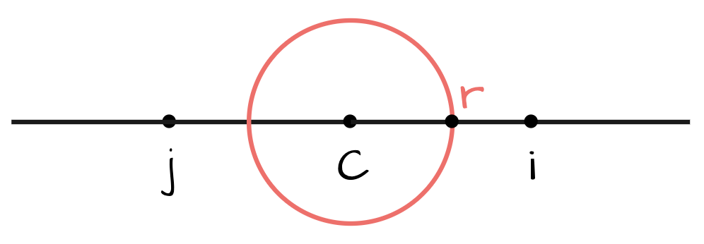
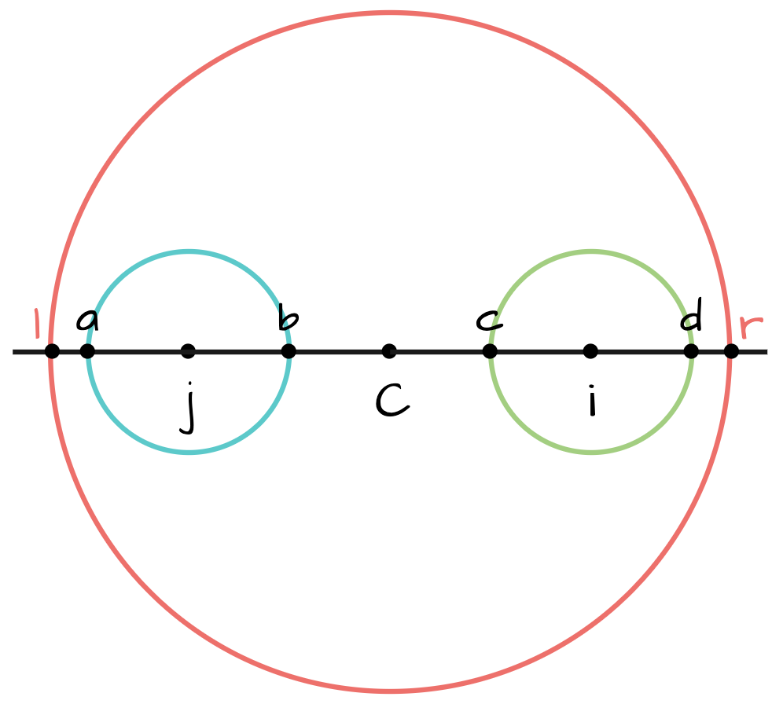
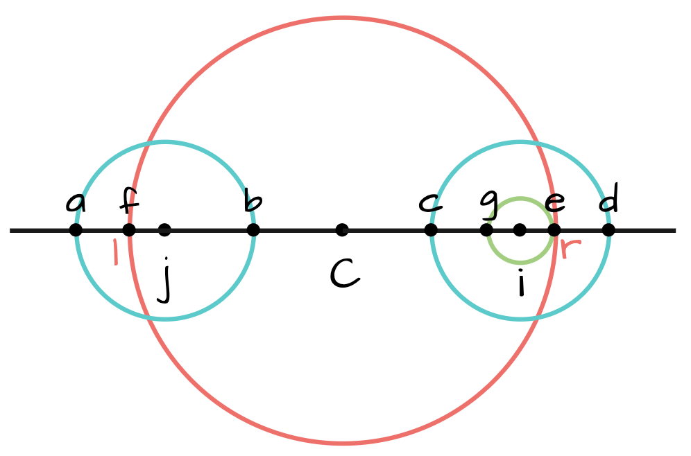

# Manacher's Algorithm

## 解决的问题

查找一个字符串中的最长回文子串。

该算法可以在线性时间内找到一个字符串的最长回文子串。

[LeetCode 5. Longest Palindromic Substring](https://leetcode.com/problems/longest-palindromic-substring/description/)

## 算法思想

该算法的基本思想是在中心扩展算法的基础上利用回文的对称特性提高算法效率。

用数组P来记录每个位置中心扩展的结果。

`P[i]的具体含义？`

以S[i]为中心可扩展的最大长度，即满足S[i-(R-1), i+(R-1)]为回文的R的最大值。

`P[i]的求解方法？`

已知，i与j关于C对称(i.e. j=2*C-i)，并且以C为中心的最大扩展长度为R, r为以C为中心的最长回文子串最后一个字符的下标。

对于位置i有三种可能：

* i >= r

对于这种情况，无法利用之前计算出的结果，所以需要以S[i]为中心执行一遍完整的中心扩展。

* i+P[j] < r

对于这种情况，P[i] = P[j]。

说明：

1. S[l, r]为以C为中心的最长的回文；
2. S[a, b]为以j为中心的最长的回文；
3. i与j、a与d、b与c关于C对称。

S[c, d] = reverse(S[a, b]) = S[a, b]，所以S[c, d]也为回文。

1、3 =》 S[c-1] = S[b+1] && S[d+1] = S[a-1]

2 =》 S[a-1] != S[b+1]

可知，S[c-1] != S[d+1]，所以S[c, d]是以i为中心的最长的回文，即P[i]=P[j]。

* i < r && i+P[j]>= r

这种情况与前一种情况类似，但是只能保证S[c, e]=reverse(S[f, b])，进而只能确定S[g, e]是回文，需要继续以i为中心从S[g-1]、S[e+1]
出发进行中心扩展。

`对于偶数长度回文子串的计算`

可以看出，以上的讨论找出的都是以一个点为中心的最长回文子串，即奇数长度的回文子串。那么如何找出所有偶数长度的回文子串呢？

偶数长度回文子串的计算与奇数长度回文子串的计算思路类似，只需要做一些细节上的调整。

`统一的计算方法`

还可以通过对原字符串进行预处理，将奇数长度和偶数长度的回文子串统一来计算。

只需要对原字符串做预处理，在两两字符之间插入‘#’，然后按照奇数长度回文子串的思路计算即可。

P'[i] = 以S中对应位置为中心的最长回文子串的长度 + 1

## 实现

## 复杂度

### 时间复杂度

O(n)

### 空间复杂度

# Refs

1. [A New Linear-Time "On-Line" Algorithm for Finding the Smallest Initial Palindrome of a String - ACM Digital Library](https://dl.acm.org/doi/10.1145/321892.321896)
2. [Manacher - OI Wiki](https://oi-wiki.org/string/manacher/)
2. [Manacher's Algorithm - Finding all sub-palindromes in O(N)](https://cp-algorithms.com/string/manacher.html)
3. [有什么浅显易懂的Manacher Algorithm讲解？](https://www.zhihu.com/question/37289584)
4. [Manacher's Longest Palindromic Substring Algorithm](http://manacher-viz.s3-website-us-east-1.amazonaws.com/#/)